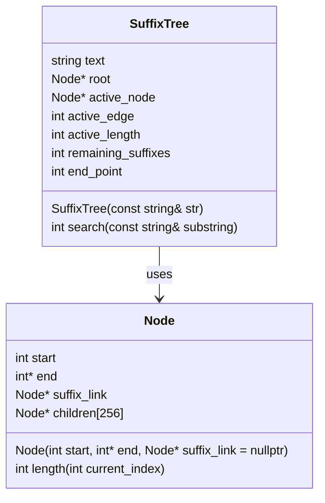

# Пояснение программы:
## Основная структура данных:

## Node — структура, представляющая узел суффиксного дерева. Узел хранит начало и конец подстроки, представляемой этим узлом, суффиксную ссылку на другой узел и массив детей для всех возможных символов ASCII.
### Конструктор Node:

Инициализирует узел, заполняя массив детей значениями nullptr.
#### Функция length:

Возвращает длину ребра, представленную узлом, учитывая текущий индекс строки.
### Класс SuffixTree:

- Хранит входную строку, корень дерева, активный узел, активное ребро, активную длину, количество оставшихся суффиксов и текущий конец для всех листьев.
- Имеет метод createNode для создания нового узла.
#### Функция extendSuffixTree:

- Расширяет суффиксное дерево для каждого символа строки, добавляя новые узлы и обновляя ссылки на узлы.
- Обрабатывает активные узлы и ребра, поддерживая корректную структуру дерева.
#### Функция buildSuffixTree:

Строит суффиксное дерево, вызывая extendSuffixTree для каждого символа входной строки.
#### Функция searchSubString:

- Ищет подстроку в суффиксном дереве, проходя по узлам и ребрам.
- Возвращает индекс начала подстроки, если она найдена, и -1, если не найдена.
#### Конструктор SuffixTree:

Инициализирует дерево и строит его с помощью buildSuffixTree.
#### Функция search:

Публичный метод для поиска подстроки, вызывающий searchSubString.
#### Функция main:

Создает суффиксное дерево для заданной строки и ищет подстроку, выводя результат.

## Uml диаграммы

